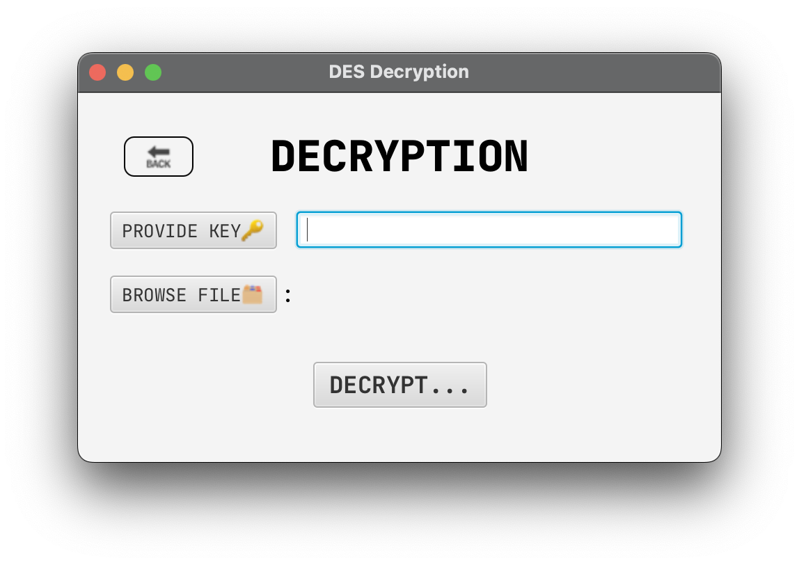

# DES GUI IMPLEMENTATION
This project is a simple implementation of the DES algorithm using JavaFX for the GUI. The project is a simple implementation of the DES algorithm and is not intended for production use. The project is intended for educational purposes only, tailored for CE372 Cryptography Lab work




## PROJECT STRUCTURE
```main
├── java
│   ├── com
│   │   └── dvc
│   │       └── des_gui
│   │           └── des
│   │               ├── DESApplication.java
│   │               ├── controllers
│   │               │   ├── DESController.java
│   │               │   ├── DecryptionController.java
│   │               │   └── EncryptionController.java
│   │               └── core
│   │                   └── DES.java
│   │                   
│   └── module-info.java
└── resources
    ├── MANIFEST.MF
    └── com
        └── dvc
            └── des_gui
                └── des
                    ├── decryption.fxml
                    ├── encryption.fxml
                    └── main.fxml

```